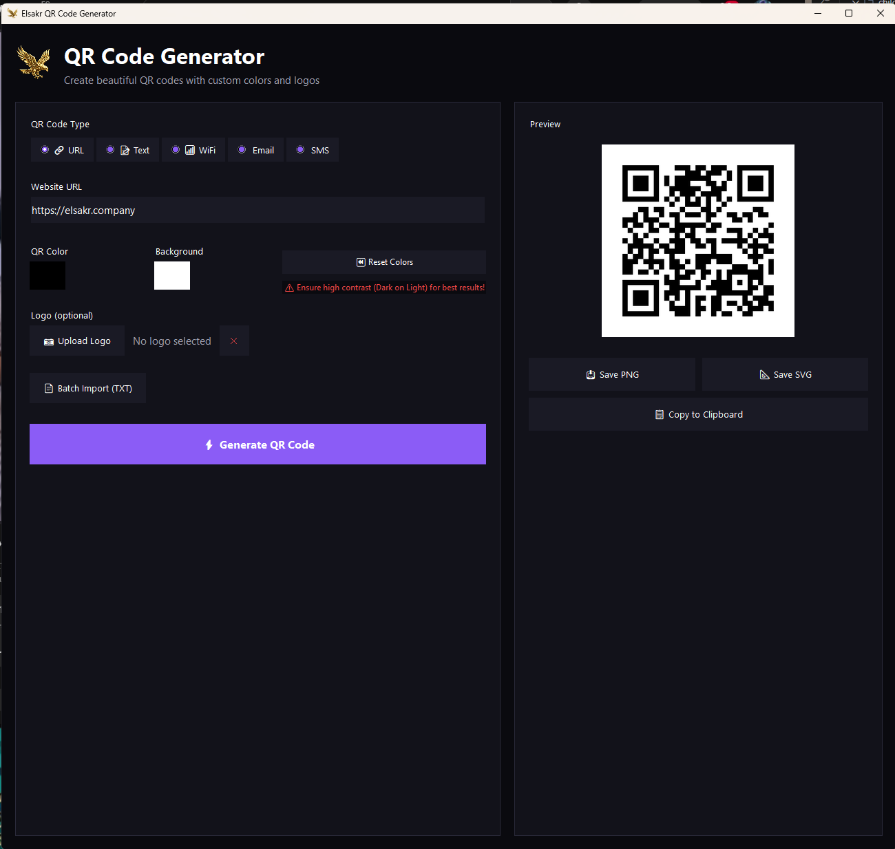

# 🦅 Elsakr QR Code Generator (Desktop)

[](https://elsakr.company)
[](https://elsakr.company)
[](LICENSE)


## Overview
Part of the **Elsakr Open Source Tools Ecosystem** — global proactive solutions for developers, designers, and marketers.
> **[View All Tools](https://elsakr.company/tools)**

**The definitive QR code generator for professionals.**
A Windows desktop application that creates high-quality QR codes with custom colors, logo overlays, and batch processing. Generate codes for URLs, WiFi credentials, vCards, and more.

## 🚀 Features
- 🔹 **5 QR Types**: URL, Text, WiFi, Email, SMS.
- 🔹 **Custom Colors**: Choose foreground and background colors.
- 🔹 **Logo Overlay**: Embed your brand logo in the center.
- 🔹 **Batch Processing**: Import TXT/CSV files for bulk generation.
- 🔹 **Export Options**: Save as PNG or SVG.
- 🔹 **100% Local**: Privacy first — nothing leaves your device.

## 📸 Screenshots / Demo


## 📦 Getting Started

### 💻 Installation
**Option 1: Download EXE**
Download from [Releases](https://github.com/khalidsakrjoker/Elsakr-QR-Code-Generator/releases).

**Option 2: Run from Source**
```bash
git clone https://github.com/khalidsakrjoker/Elsakr-QR-Code-Generator.git
cd Elsakr-QR-Code-Generator
pip install -r requirements.txt
python main.py
```

### ▶️ Usage
1. **Select Type**: Choose QR type (URL, WiFi, vCard, etc.).
2. **Enter Data**: Fill in the required fields.
3. **Customize**: Pick colors and upload a logo (optional).
4. **Generate**: Click "Generate QR Code".
5. **Download**: Save as PNG or SVG, or use batch import for bulk.

### 🔧 Build EXE
```bash
pyinstaller --noconsole --onefile --icon="assets/fav.ico" --name="Elsakr QR Code Generator" --add-data "assets;assets" main.py
```

## 🤝 Contributing
We welcome contributions!
1. Fork the repo.
2. Create your branch.
3. Push changes.
4. Open a Pull Request.

## 📝 License
This project is licensed under the MIT License.

## ⭐ Signature
**Elsakr** — *Open Source Tools with a Falcon's Vision.*  
[elsakr.company](https://elsakr.company)

---

# 🇪🇬 النسخة العربية (Arabic Version)

## 🦅 مولد أكواد الـ QR (Desktop Version)
تطبيق سطح مكتب احترافي لإنشاء أكواد QR بجودة عالية. يدعم تخصيص الألوان، إضافة لوجو، ومعالجة دفعات كبيرة من الأكواد مرة واحدة.
**100% على جهازك — بياناتك مابتخرجش.**
